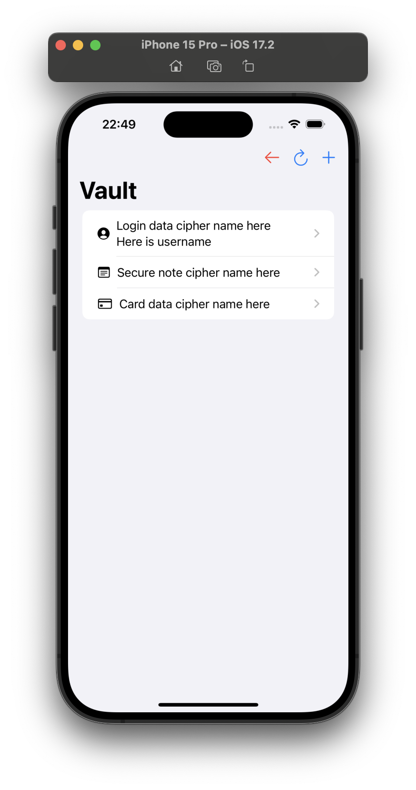

# LibrePass-iOS

LibrePass client for iOS. Written in SwiftUI.

### Update issues
If app crashes after update, you probably need to clear vault unfortunately.

### Used libraries:
- SwiftUI
- SwiftData
- Apple CryptoKit
- Argon2Swift
- SwiftOTP
- CodeScanner
